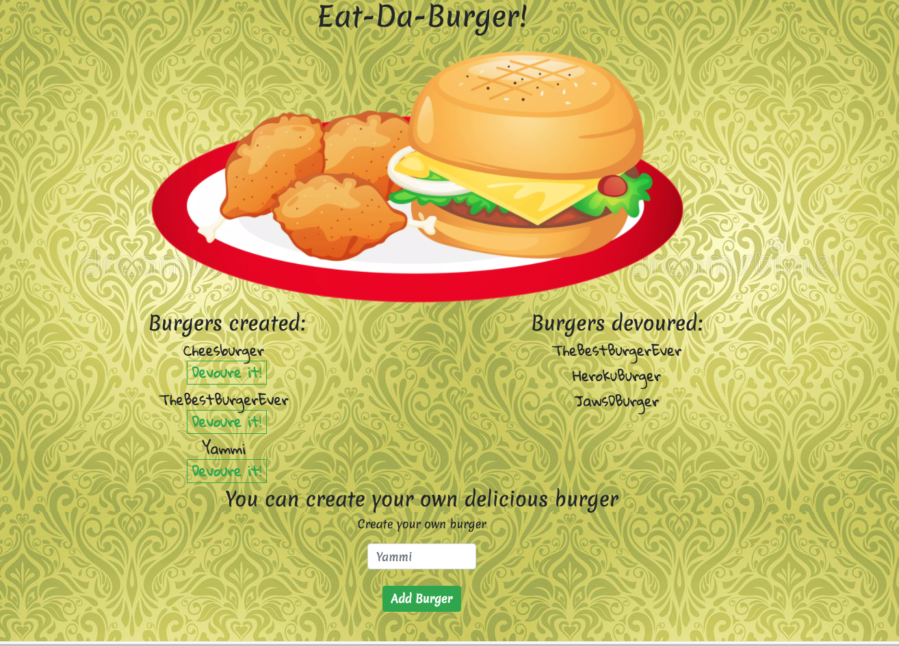

# Eat-Da-Burger
This is a burger eater's app built with MySQL, Node, Express, Handlebars and Sequelize.
The directory structure of this app follows the MVC design pattern.

* Eat-Da-Burger! is a restaurant app that lets users input the names of burgers they'd like to eat.
* Whenever a user submits a burger's name, this app will display the burger on the left side of the page -- waiting to be devoured.
* Each burger in the waiting area also has a `Devour it!` button. When the user clicks it, the burger will move to the right side of the page.
* This app will store every burger in a database, whether devoured or not.

## Screenshots

## Link to test the app
https://pure-garden-61829.herokuapp.com/